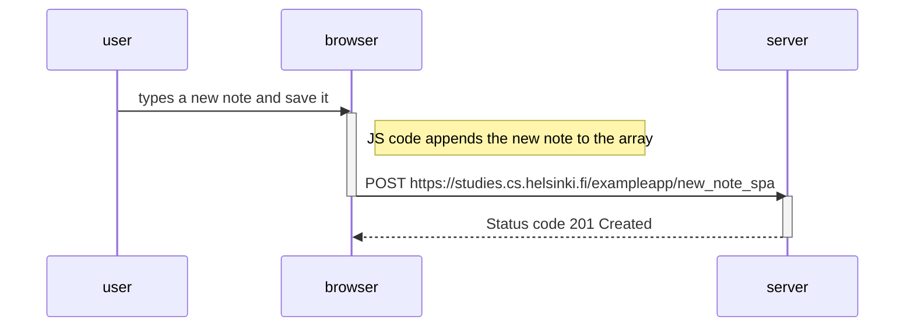

```mermaid
sequenceDiagram
    participant user
    participant browser
    participant server
    
    user->>browser: types a new note and save it
    activate browser 
    Note right of browser: JS code appends the new note to the array   
    

    browser->>server: POST https://studies.cs.helsinki.fi/exampleapp/new_note_spa
    deactivate browser    
    activate server
    server-->>browser: Status code 201 Created
    deactivate server
    
```